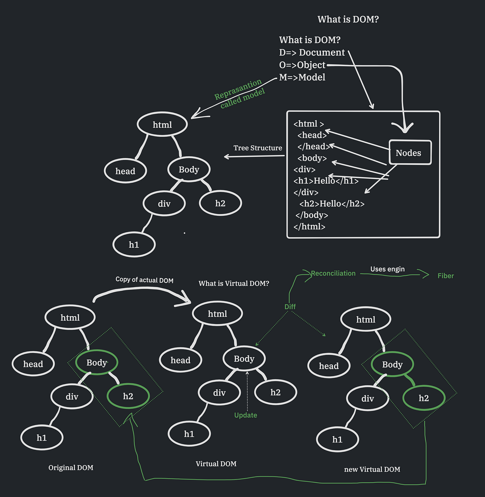

# Day 01 — React Fundamentals: What’s Under the Hood

### JSX → Elements • Virtual DOM • Reconciliation (Fiber) • Render & Commit • Lifecycle & Hooks • When to choose React • Ecosystem

> Goal: Build a solid mental model of **how React updates the UI efficiently** and when to use it.

---

## Agenda

1. What is React & why it exists
2. JSX & React Elements
3. Element Tree (blueprint)
4. Virtual DOM & Flow
5. Reconciliation (Fiber) & Keys
6. Render & Commit phases (Two‑Phase Cycle)
7. Lifecycle & Hooks essentials
8. When to choose React
9. Ecosystem tour
10. Mini–hands-on exercises & quiz

---

## Learning Outcomes

By the end of Day 01, you will:

- Explain how JSX becomes **React elements** and ultimately **DOM**.
- Describe **Virtual DOM**, **diffing**, and why React updates are efficient.
- Understand **Fiber** and the difference between **render** and **commit** phases.
- Use basic **hooks** (`useState`, `useEffect`) and reason about lifecycle.
- Identify scenarios where **React** is (and isn’t) the right choice.

---

## Why React Exists

- Direct DOM manipulation is **imperative** → error‑prone and hard to scale.
- DOM updates are **expensive** (reflows, repaints).
- Performance issues appear as UIs grow complex.
- **Declarative approach**: Describe **what** UI should look like; React figures out **how** to update it.
- Predictable updates via **state → re‑render → diff → commit**.

---

## Imperative vs Declarative

**Imperative (vanilla DOM)**

```js
const el = document.createElement("button");
el.textContent = "Clicked 0 times";
let count = 0;
el.addEventListener("click", () => {
  count++;
  el.textContent = `Clicked ${count} times`;
});
document.body.appendChild(el);
```

---

**Declarative (React)**

```jsx
function Button() {
  const [count, setCount] = React.useState(0);
  return (
    <button onClick={() => setCount((c) => c + 1)}>
      Clicked {count} times
    </button>
  );
}
```

> In React, we re-describe the **UI for a given state**; React updates the DOM efficiently.

---

## JSX & React Elements

- **JSX** = JavaScript XML, syntax sugar for describing UI.
- Transpiled by Babel/TypeScript to `React.createElement` calls.

**JSX**

```jsx
const el = <h1 className="title">Hello, React!</h1>;
```

**Transpiled (conceptually)**

```js
const el = React.createElement("h1", { className: "title" }, "Hello, React!");
```

---

**React Element (plain object)**

```js
{
  type: 'h1',
  props: { className: 'title', children: 'Hello, React!' }
}
```

> Elements are **lightweight descriptions** of what to render, not real DOM nodes.

---

## Element Tree (React 18+)

```jsx
import { createRoot } from "react-dom/client";
import App from "./App";

const container = document.getElementById("root");
const root = createRoot(container);
root.render(<App />);
```

- React builds a **tree of elements** from your components.
- The tree is compared to the previous one → **diff** → minimal DOM updates.

---

## Virtual DOM

- A **lightweight JS representation** of the real DOM.
- React updates **Virtual DOM** first, then determines the **minimal set of real DOM changes**.
- **Key benefit:** Only update what changed.

**Why it’s fast**

- JS operations are cheaper than touching DOM.
- React batches updates to avoid layout thrashing.


---

## Reconciliation & Fiber (High-level)

- **Reconciliation** = comparing the new element tree with the previous one (**diffing**).
- **Fiber** = React’s internal architecture for splitting work into **units** that can be paused and resumed.
- Enables **responsive UIs** by prioritizing urgent updates and batching non-urgent ones.

---

**Key heuristics**

- Different `type` → **replace** node.
- Same `type` → **update** props and children.
- **Keys** help React match children across renders.

---

**Example:**

```html
<!-- Old -->
<ul>
  <li>Apple</li>
  <li>Banana</li>
</ul>

<!-- New -->
<ul>
  <li>Apple</li>
  <li>Mango</li>
</ul>
```

React updates only the changed `<li>`.

---

## Keys Matter

**Bad (index as key)**

```jsx
{
  items.map((item, i) => <Row key={i} value={item} />);
}
```

**Good (stable unique key)**

```jsx
{
  items.map((item) => <Row key={item.id} value={item} />);
}
```

---

> Using indices as keys can cause incorrect state association and extra re‑renders when items are inserted/removed/reordered.

---

## Fiber Architecture

- Fiber = React’s internal architecture (React 16+).
- Breaks rendering into **units of work (Fibers)**.
- Benefits:
  - Interruptible & async rendering
  - Prioritization of updates
  - Pausing & resuming work

---



---


---

## Render vs Commit (Two‑Phase Cycle)

1. **Render / Reconciliation Phase**
   - Build work‑in‑progress Fiber tree
   - Diffing happens here
   - Async & interruptible (Can be paused)
2. **Commit Phase**
   - Apply changes to real DOM synchronously
   - Run lifecycle methods & effects (`useEffect`, `componentDidMount`)

---

**Automatic batching (React 18+)**

```jsx
setCount((c) => c + 1);
setText("hello");
// One re-render, one commit (batched)
```

---

## Component Lifecycle & Hooks

**Lifecycle moments**

- **Mount** → component added to the DOM
- **Update** → state/props change triggers render
- **Unmount** → component removed

---

**Hooks**

- `useState` — local state
- `useEffect` — side effects (fetch, timers, cleanup)

```jsx
function Clock() {
  const [now, setNow] = React.useState(() => new Date());
  React.useEffect(() => {
    const id = setInterval(() => setNow(new Date()), 1000);
    return () => clearInterval(id);
  }, []);
  return <time>{now.toLocaleTimeString()}</time>;
}
```

---

## When to Choose React

**Great fit**

- Interactive UIs, complex state flows, dashboards, SPAs/MPAs.
- Teams valuing component reuse, strong ecosystem, TS support.

**Maybe not**

- Mostly static sites with minimal interactivity.
- Extremely simple pages where vanilla HTML/CSS/JS suffices.

---

## Ecosystem Overview

- **Rendering targets**: `react-dom`, React Native
- **State**: Context, Redux, Zustand, Jotai
- **Styling**: CSS Modules, Tailwind CSS, styled-components
- **Tooling**: Babel, Webpack, Vite, SWC
- **Frameworks**: Next.js App Router
- **DevTools**: React DevTools, ESLint, Prettier

---

## Hands‑on #1 — Counter (JSX + State)

```jsx
function Counter() {
  const [count, setCount] = React.useState(0);
  return (
    <div>
      <h2>Count: {count}</h2>
      <button onClick={() => setCount((c) => c + 1)}>+1</button>
      <button onClick={() => setCount(0)}>Reset</button>
    </div>
  );
}
```

---

## Hands‑on #2 — List & Keys

```jsx
function PlayersList({ players }) {
  return (
    <ul>
      {players.map((p) => (
        <li key={p.id}>{p.name}</li>
      ))}
    </ul>
  );
}
```

---

## Common Pitfalls

- **Directly mutating state** instead of using setter
- Using **array index as key**
- Placing **side effects in render body** (should be in `useEffect`)
- Assuming **state updates are synchronous**
- Forgetting to **clean up effects**

---

## Quick Quiz

1. What does JSX compile to?
2. What’s the purpose of the Virtual DOM?
3. When should you avoid using array index as a key?
4. Name the two high-level phases of an update.

---

## Discussion Prompts

- Where in your current codebase would React’s declarative model simplify logic?
- Which components could benefit most from stable keys and memoization?

---

## Appendix — Batching & Transitions (Preview)

---

**Automatic batching** even across async boundaries.

```jsx
function Example() {
  const [count, setCount] = React.useState(0);
  const [text, setText] = React.useState("");

  function handleClick() {
    fetch("/api/data").then(() => {
      setCount((c) => c + 1);
      setText("Loaded!");
    });
  }

  return (
    <div>
      <button onClick={handleClick}>Load</button>
      <div>{count}</div>
      <div>{text}</div>
    </div>
  );
}
```

---

**Transitions** mark non‑urgent updates.

```jsx
import { startTransition } from "react";

function Search({ query, setQuery }) {
  function onInput(e) {
    const q = e.target.value;
    setQuery(q); // urgent
    startTransition(() => {
      // non-urgent
      // setFilteredData(expensiveFilter(q));
    });
  }
  return <input value={query} onChange={onInput} />;
}
```

---

## Resources

- React Docs: _Main Concepts_ & _Reconciliation_
- React DevTools (Chrome/Firefox)
- Babel REPL (to view JSX → JS transform)

---

## Next Session

- **JavaScript advanced refresher**: ES6+, arrays, async/await, closures.
- Prepare: Bring an example of imperative DOM code you’ve written recently.
