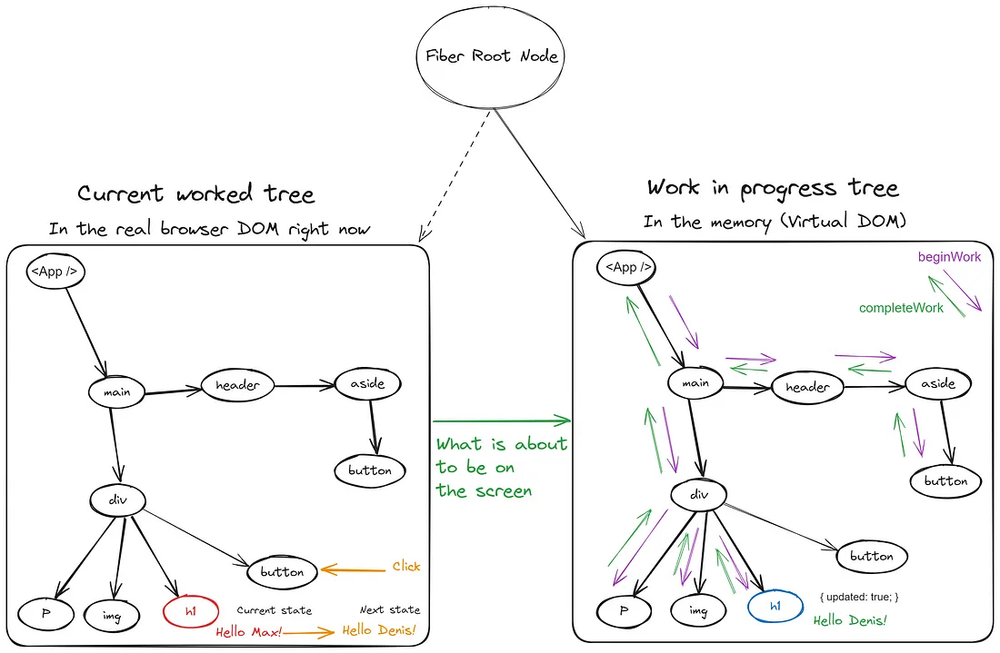

# What's Under the Hood in React.js

_How React efficiently manages UI updates without touching the DOM directly._

---

## Why care?

- DOM updates are expensive (reflows, repaints).
- React uses smart internals to minimize work and keep UIs smooth.
- We'll cover: **JSX → React Elements**, **Virtual DOM**, **Reconciliation**, **Fiber**, and the **Two‑phase cycle**.

---

## JSX & React Elements

JSX is **syntactic sugar** for `React.createElement`.

```jsx
// JSX
const element = <h1>Hello, world!</h1>;
```

Transpiles to:

```js
// After Babel transpiles JSX
const element = React.createElement("h1", null, "Hello, world!");
```

Result: a plain **JavaScript object** (React element) that describes the UI.

---

## Element Tree (Blueprint)

- React elements form a **tree** (component tree).
- This tree is a **blueprint** used to build the Virtual DOM.

---

## The Virtual DOM (VDOM)

- Lightweight, in-memory representation of the real DOM.
- Cheap to create & manipulate in JS.
- React updates the VDOM on state/prop changes, diffs it, then applies minimal changes to the real DOM.

**Key benefit:** only update what changed — not the whole page.

---

## Virtual DOM Flow

<br/>
<br/>
<br/>


---


---

## Reconciliation (Diffing)

- Reconciliation = matching the new VDOM to the old VDOM.
- React's diffing algorithm finds the **smallest set of changes**.

---

**Example:**

```html
<!-- Old -->
<ul>
  <li>Apple</li>
  <li>Banana</li>
</ul>

<!-- New -->
<ul>
  <li>Apple</li>
  <li>Mango</li>
</ul>
```

React updates only the changed `<li>`.

---

## Applying Patches

- React **batches** changes.
- Renderer (ReactDOM / React Native) applies patches to the actual UI.
- Batching reduces layout thrashing and improves throughput.

---

## Fiber Architecture (React 16+)

- Fiber is a **complete rewrite** of React's core renderer.
- It breaks rendering into **units of work** (Fibers).
- Fibers allow:
  - Interruptible & asynchronous rendering
  - Prioritization of updates
  - Pausing & resuming work

---

## Fiber Tree

Each Fiber stores state, props, and links to parent/child/sibling.

---


---



---

## Two‑Phase Render Cycle

1. **Render / Reconciliation Phase**
   - Build a work‑in‑progress Fiber tree.
   - Diffing happens here.
   - **Asynchronous & interruptible.**
2. **Commit Phase**
   - Apply changes to the real DOM **synchronously**.
   - Run lifecycle methods and effects (`componentDidMount`, `useEffect`).

---

## Why it matters

- Smooth user interactions (typing, animations).
- Better perceived performance through prioritization.
- Predictable lifecycle: render diffing separate from DOM mutations.

---

## Summary

- **JSX → React Elements**: syntactic sugar to create element objects.
- **Virtual DOM**: fast in-memory representation for cheap diffs.
- **Reconciliation**: computes the minimal set of changes.
- **Fiber**: makes rendering interruptible and prioritized.
- **Two‑Phase Cycle**: async render + sync commit.

---

## Slide Suggestions & Q&A

- Intro: Why internal mechanisms?
- JSX & elements: show code + transpilation
- VDOM: show diagram
- Diffing: small example
- Fiber: flowchart + benefits
- Two‑phase cycle: timeline
- **Q&A**
